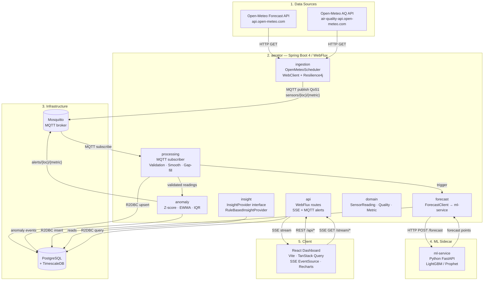
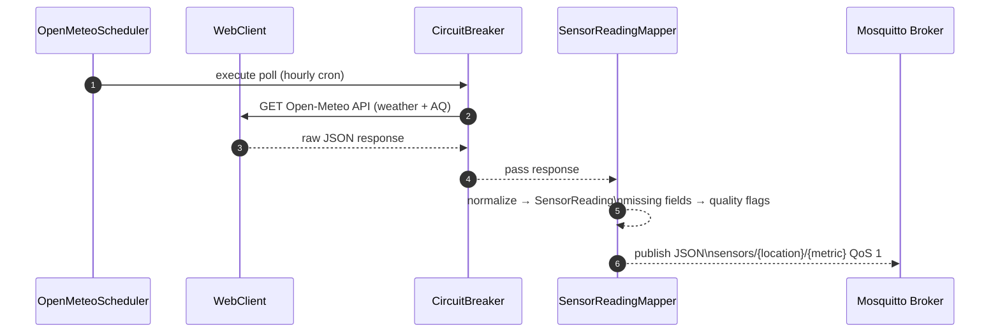
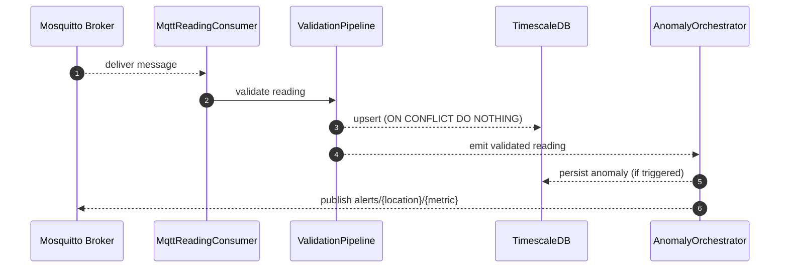
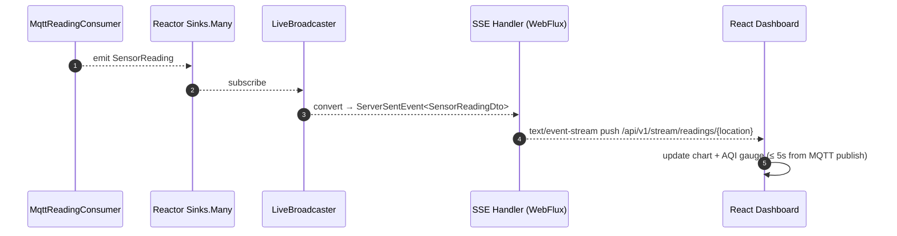
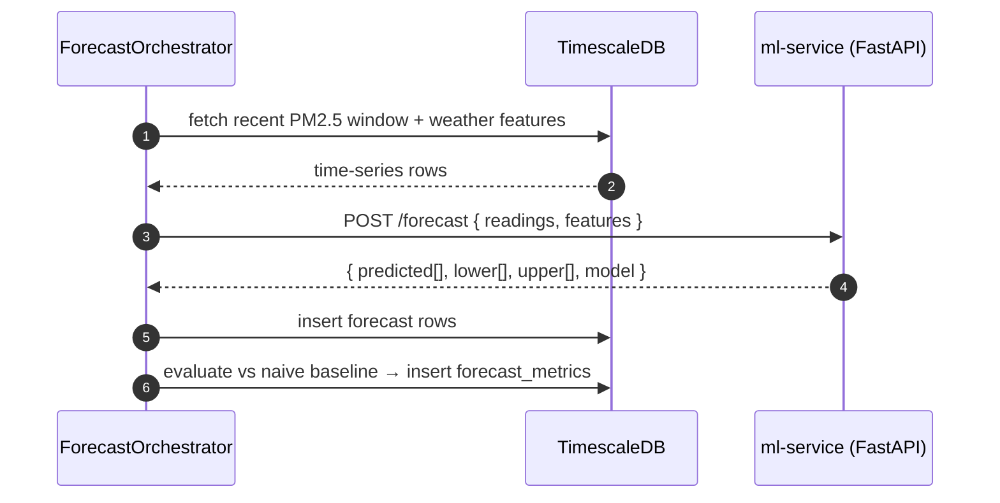
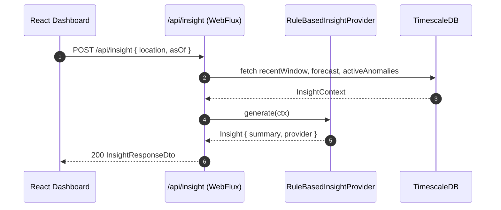

# Real-Time Environmental Sensor Dashboard — High-Level Design

| Attribute   | Value                           |
|-------------|---------------------------------|
| **Date**    | 2026-05-22                      |
| **Status**  | In Review                       |
| **Version** | 1.0                             |
| **Author**  | Maulana Iskak                   |

---

## Table of Contents

- [Overview](#overview)
- [Impacted Applications](#impacted-applications)
- [Requirements Overview](#requirements-overview)
- [Technical Implementation](#technical-implementation)
- [System Architecture](#system-architecture)
- [Data Model](#data-model)
- [API Design](#api-design)
- [GraalVM Native Strategy](#graalvm-native-strategy)
- [Security Considerations](#security-considerations)
- [Observability](#observability)
- [Testing Strategy](#testing-strategy)
- [Deployment Plan](#deployment-plan)
- [Risk, Limitations & Out of Scope](#risk-limitations--out-of-scope)
- [Open Items](#open-items)
- [Assumptions](#assumptions)
- [Revision History](#revision-history)

---

## Overview

A real-time environmental monitoring platform that ingests **weather + air-quality data** from public Open-Meteo APIs, streams readings through an **MQTT-based pipeline** (Eclipse Mosquitto), applies **signal processing and ML forecasting**, generates **deterministic rule-based insights**, and presents everything on a **React + Vite** dashboard with live Server-Sent Events push.

### Background

This is a portfolio / showcase project demonstrating end-to-end backend engineering competence: HTTP-pull ingestion → MQTT streaming → time-series persistence → ML forecasting → REST + SSE API → reactive frontend. The "virtual sensor gateway" pattern honestly models how real IoT edge devices bridge heterogeneous HTTP sources onto an MQTT backbone.

### Goals

- **G1** — Ingest weather + air-quality from Open-Meteo (two separate API hosts) on a configurable schedule and normalize into a canonical `SensorReading` envelope.
- **G2** — Demonstrate an IoT-native MQTT pipeline even with HTTP-pull sources: the ingestion gateway acts as a virtual edge device.
- **G3** — Apply signal processing (smoothing, gap-filling, validation, anomaly detection) on the ingested time-series.
- **G4** — Serve a short-horizon PM2.5 forecast (6–24 h) from a Python FastAPI ML sidecar.
- **G5** — Provide a deterministic rule-based insight engine behind a swappable `InsightProvider` interface (LLM implementation deferred to v2).
- **G6** — Present live + historical data on a React dashboard with sub-5-second pipeline latency from MQTT publish to browser render.
- **G7** — Be runnable by anyone via `docker compose up` with zero manual configuration; local-first deployment target for v1.

### Non-Goals

- LLM / natural-language insight (v2 — behind interface, not built now).
- Real physical IoT hardware — data is sourced from modelled forecasts (documented honestly).
- User accounts, auth, or multi-tenancy.
- Hosted / cloud deployment in v1.
- Horizontal scale — single-node Docker Compose is the target.
- Mobile app.

---

## Impacted Applications

| Application              | Impact Type | Description                                                        |
|--------------------------|-------------|--------------------------------------------------------------------|
| **aerator** (Spring Boot) | New         | Modular monolith: ingestion, processing, anomaly, insight, API     |
| **ml-service** (Python)  | New         | FastAPI + LightGBM/Prophet PM2.5 forecasting sidecar               |
| **frontend** (React/Vite)| New         | TypeScript dashboard: charts, AQI gauge, forecast overlay, insights|
| **mosquitto** (broker)   | New (infra)  | Eclipse Mosquitto 2.x MQTT broker via Docker                       |
| **postgres-timescale**   | New (infra)  | PostgreSQL 16 + TimescaleDB 2.x via Docker                         |

---

## Requirements Overview

### Functional Requirements

| ID     | Requirement                                                                                        | Priority     |
|--------|----------------------------------------------------------------------------------------------------|--------------|
| FR-01  | Poll Open-Meteo Forecast API (`api.open-meteo.com`) for weather metrics on a cron schedule         | Must Have    |
| FR-02  | Poll Open-Meteo Air Quality API (`air-quality-api.open-meteo.com`) for PM2.5, PM10, AQI metrics   | Must Have    |
| FR-03  | Normalize API responses into `SensorReading` envelope; map missing fields → quality flags, no crash| Must Have    |
| FR-04  | Publish each reading to MQTT topic `sensors/{location}/{metric}` at QoS 1                         | Must Have    |
| FR-05  | Subscribe to MQTT and upsert readings into TimescaleDB hypertable (idempotent on `sensor_id + observed_at`) | Must Have |
| FR-06  | Per-datum validation: type check, physical range, staleness, null presence → `Quality` verdict     | Must Have    |
| FR-07  | Rolling-mean / EWMA smoothing per metric (stored as derived column; raw never overwritten)         | Must Have    |
| FR-08  | Gap-filling: detect missing hourly intervals, interpolate, flag as `IMPUTED`                       | Should Have  |
| FR-09  | Anomaly detection (z-score / EWMA-residual / IQR) on validated readings → emit `alerts/{loc}/{metric}` + persist | Must Have |
| FR-10  | Python ML sidecar: 6–24 h PM2.5 forecast with lower/upper confidence band, stored in `forecast` table | Must Have |
| FR-11  | Track model MAE/RMSE on temporal hold-out vs naive persistence baseline; expose `/api/forecast/metrics` | Must Have |
| FR-12  | `InsightProvider` interface + `RuleBasedInsightProvider` (deterministic, no external deps)         | Must Have    |
| FR-13  | REST API: `/api/v1/readings`, `/api/v1/forecast`, `/api/v1/anomalies`, `/api/v1/insight`           | Must Have    |
| FR-14  | SSE live push (`text/event-stream`): new readings + alerts within ≤ 5 s of MQTT publish           | Must Have    |
| FR-15  | React dashboard: live multi-metric charts, AQI gauge, forecast overlay with band, anomaly markers | Must Have    |
| FR-16  | "Explain this" button → calls `/api/insight`, renders rule-based summary                           | Must Have    |
| FR-17  | API downtime resilience: retry with exponential backoff + circuit breaker on Open-Meteo calls     | Must Have    |
| FR-18  | `docker compose up` → working dashboard in < 3 min, zero manual config                            | Must Have    |

### Non-Functional Requirements

| ID      | Requirement                           | Target                                         |
|---------|---------------------------------------|------------------------------------------------|
| NFR-01  | MQTT publish → dashboard render       | ≤ 5 s (transport latency, not data freshness)  |
| NFR-02  | Idempotent re-polling                 | No duplicate rows — DB UNIQUE enforced         |
| NFR-03  | GraalVM native build                  | `./gradlew nativeCompile` produces runnable binary |
| NFR-04  | Test coverage (ingestion + processing)| Meaningful unit tests + ≥ 1 integration test   |
| NFR-05  | Compose startup                       | All services healthy within 3 minutes          |
| NFR-06  | UTC everywhere                        | All DB timestamps TIMESTAMPTZ; FE localizes only |
| NFR-07  | Forecast reproducibility              | Documented model + metrics in README           |

---

## Prerequisites (Must Complete Before M0)

The following changes must be applied to the skeleton **before** any feature work begins. They are not optional.

| # | Action | Reason |
|---|--------|--------|
| P-01 | Rename base package `io.trade.order.aerator` → `io.aether` in all source files, `build.gradle` group, and `settings.gradle` | HLD module structure is rooted at `io.aether`; implementing under the old name means a high-friction rename mid-project |
| P-02 | Remove `spring-boot-starter-webmvc` (already done in `build.gradle` by this HLD) | WebMVC and WebFlux on the same classpath silently forces the servlet dispatcher, breaking Netty, R2DBC, and reactive routing |
| P-03 | Add all dependencies listed in §Build Configuration (already applied to `build.gradle`) | Flyway, R2DBC, Spring Integration MQTT, Resilience4j, Actuator |

---

## Technical Implementation

### Overview

The aerator backend is a **Spring Boot 4.0 modular monolith** backed by **Project Reactor / WebFlux** throughout. Logical boundaries are enforced by Java package dependencies on a shared `domain` module — no inter-package circular imports. The one genuinely separate runtime process is the Python ML sidecar, called over HTTP by the aerator's forecast orchestrator.

### Stack Summary

| Layer         | Technology                                    | Notes                                              |
|---------------|-----------------------------------------------|----------------------------------------------------|
| Language      | **Java 21**                                   | Records, pattern matching, virtual threads (Loom)  |
| Framework     | **Spring Boot 4.0.6** (Spring Framework 7)    | Already in `build.gradle`                          |
| Reactive      | **Project Reactor 3.7 / WebFlux**             | Primary API layer; WebMVC removed (see P-02)       |
| MQTT client   | **Eclipse Paho MQTT v5** (Spring Integration MQTT) | `spring-integration-mqtt` 7.x                 |
| DB driver     | **R2DBC (r2dbc-postgresql)**                  | Reactive DB access; Flyway uses JDBC for migrations|
| Migrations    | **Flyway 11.x**                               | Requires explicit `@FlywayDataSource` JDBC bean — see §Deployment Plan |
| HTTP client   | **WebClient** (built-in WebFlux)              | Open-Meteo API calls; resilience4j circuit breaker |
| ML service    | **Python 3.12 + FastAPI + LightGBM**          | Separate Docker container; Spring calls via WebClient |
| Frontend      | **React 19 + Vite 6 + TypeScript**            | TanStack Query, SSE (`EventSource`), Recharts      |
| Build         | **Gradle 9** + `spotlessApply`                | GraalVM native plugin already configured           |
| Container     | **Docker Compose v2**                         | All services: mosquitto, postgres, aerator, ml, fe |
| CI            | **GitHub Actions**                            | build + test + lint + docker build                 |
| Observability | **Micrometer + Prometheus + Grafana**         | Optional but wired (nice-to-have)                  |

### Module Structure (Modular Monolith)

```
io.aether
├── domain           # Shared value types: SensorReading, Quality, Location, Metric — no deps on other modules
├── ingestion        # Open-Meteo HTTP polling → SensorReading → MQTT publish
├── processing       # MQTT subscribe → upsert, smoothing, gap-fill, validation
├── anomaly          # Anomaly detection (z-score/EWMA/IQR) on validated readings
├── forecast         # HTTP client to Python ML sidecar; store results; expose metrics
├── insight          # InsightProvider interface + RuleBasedInsightProvider
└── api              # WebFlux router, SSE broadcaster, MQTT alert publisher, REST controllers
```

**Dependency rule:** all modules may depend on `domain`; no module may depend on another module except `api` (which wires them together). Enforced via ArchUnit in tests.

**Inter-module communication without circular imports:** modules publish `domain`-level Spring `ApplicationEvent` subclasses (e.g., `ReadingValidatedEvent`, `AnomalyDetectedEvent`). Listeners in other modules subscribe via `@EventListener` (or reactive `ApplicationEventMulticaster`). This keeps `processing` from importing `forecast` directly — both depend only on `domain` events.

```
ingestion   →  publishes PollCycleCompletedEvent(location)   (domain)
processing  →  publishes ReadingValidatedEvent(reading)       (domain)
forecast    →  @EventListener(PollCycleCompletedEvent)  → one forecast run per location per cycle
anomaly     →  @EventListener(ReadingValidatedEvent)    → runs detectors per validated reading
api         →  @EventListener(ReadingValidatedEvent)    → relays to Sinks.Many<SensorReading> → SSE
api         →  @EventListener(AnomalyDetectedEvent)     → relays to Sinks.Many<AnomalyEvent> → SSE + MQTT alerts/#
```

### Key Components

#### 1. Domain Module (`io.aether.domain`)

- `SensorReading` — Java record; canonical envelope per §7 of PRD. `schemaVersion` field; consumers reject unknown major versions.
- `Quality` — record: `status` (OK / SUSPECT / REJECTED), `flags` (set of `QualityFlag` enum: `MISSING_VALUE`, `OUT_OF_RANGE`, `STALE`, `IMPUTED`, `ANOMALOUS`).
- `Location` — record: `name`, `lat`, `lon`.
- `Metric` — enum: `TEMPERATURE`, `HUMIDITY`, `WIND_SPEED`, `PRESSURE`, `PM2_5`, `PM10`, `O3`, `NO2`, `SO2`, `CO`, `US_AQI`, `EU_AQI`.
- `SensorId` — value type: `source:location:metric` convention.
- `ReadingValidatedEvent` — Spring `ApplicationEvent` carrying a validated `SensorReading`; published by `processing`, consumed by `anomaly` and `api`.
- `PollCycleCompletedEvent` — Spring `ApplicationEvent` carrying a `Location`; published by `ingestion` after all readings for a location are dispatched in a single poll tick; consumed by `forecast` to trigger one batch run per cycle.
- `AnomalyDetectedEvent` — Spring `ApplicationEvent` carrying an `AnomalyEvent`; published by `anomaly`, consumed by `api` (relays to SSE stream and MQTT alerts topic).

> **MQTT ownership:** `ingestion` owns publishing to `sensors/{loc}/{metric}`. `api` owns publishing to `alerts/{loc}/{metric}` — it subscribes to `AnomalyDetectedEvent` and routes it to Mosquitto via a second `Mqttv5PahoMessageHandler` bean. This keeps MQTT I/O confined to the two boundary modules (`ingestion` + `api`) without any cross-module import violations.

#### 2. Ingestion Gateway (`io.aether.ingestion`)

- `OpenMeteoScheduler` — uses `@Scheduled` with a virtual-thread executor (Spring Boot 4 / Java 21 Loom). The method body calls `.subscribe()` on the reactive `Flux<SensorReading>` pipeline — Loom's virtual thread parks while waiting, keeping Netty's event loop free. Emits two polls per configured location per cron tick: one to the forecast API, one to the air-quality API. After all readings for a location are published, emits a `PollCycleCompletedEvent(location)` so `ForecastOrchestrator` can batch-trigger once per cycle.
- `OpenMeteoWeatherClient` / `OpenMeteoAirQualityClient` — WebClient wrappers with Resilience4j `CircuitBreaker` + `Retry` (exponential backoff). Returns `Flux<SensorReading>`.
- `SensorReadingMapper` — maps raw JSON DTOs → `SensorReading`. Null/missing fields → `Quality.MISSING_VALUE` flag; value out of physical range → `Quality.OUT_OF_RANGE`; never throws.
- `MqttPublisher` — wraps `Mqttv5PahoMessageHandler` (Spring Integration MQTT v5 outbound adapter). Publishes serialized JSON to `sensors/{location}/{metric}` at QoS 1. Wired as an `IntegrationFlow` bean: `IntegrationFlow.from(mqttOutboundChannel()).handle(mqttv5Handler()).get()`. Client ID is stable (configurable, not random-per-restart) to ensure QoS 1 session continuity.
- Topic taxonomy:
  - `sensors/{location}/{metric}` — raw readings
  - `alerts/{location}/{metric}` — anomaly events
  - `aether/system/heartbeat` — 30-second health beat

#### 3. Processing & Signal (`io.aether.processing`)

- `MqttReadingConsumer` — wraps `Mqttv5PahoMessageDrivenChannelAdapter` (Spring Integration MQTT v5 inbound adapter). Subscribes to `sensors/#`; pushes deserialized `SensorReading` into a `Sinks.Many<SensorReading>`. Wired as `IntegrationFlow.from(mqttv5InboundAdapter()).handle(readingConsumer()).get()`.
- `ReadingPersistenceHandler` — upserts into `sensor_reading` via R2DBC. Uses `ON CONFLICT (sensor_id, observed_at) DO NOTHING` (idempotent).
- `ValidationPipeline` — chain of `ReadingValidator` implementations (range, staleness, presence). Returns `SensorReading` with updated `Quality`. Runs per-datum, synchronous logic wrapped in reactive operators.
- `SmoothingService` — computes EWMA per `(sensor_id)` window; stores smoothed value in `sensor_reading.smoothed_value` column; never overwrites `value`.
- `GapFillService` — detects missing hourly slots for a sensor; interpolates linearly; inserts synthetic rows with `IMPUTED` flag. **Trigger: scheduled task every 5 minutes, look-back window of 2 hours per sensor.** Not per-message (avoids O(n) history scan on the hot ingest path).

#### 4. Anomaly Detection (`io.aether.anomaly`)

- Operates only on **non-rejected** readings (Quality.status ≠ REJECTED).
- Detectors: `ZScoreDetector`, `EwmaResidualDetector`, `IqrDetector` — all implement `AnomalyDetector` interface.
- `AnomalyOrchestrator` — selects detector per metric; emits `AnomalyEvent` → persists to `anomaly` table + publishes to `alerts/{loc}/{metric}` MQTT topic.
- Window size is configurable (default: last 48 readings per sensor).

#### 5. ML Forecast Service (`io.aether.forecast`)

- `ForecastClient` — `WebClient` calling Python FastAPI sidecar at `http://ml-service:8000/forecast`.
- `ForecastOrchestrator` — triggered by `PollCycleCompletedEvent(location)`, **not** by `ReadingValidatedEvent`. This ensures exactly one forecast run per location per poll cycle (3/hour for 3 locations), not one per reading (which would be 36/hour and 36× the DB + HTTP cost). Calls sidecar; persists `forecast` rows via upsert on `(location, metric, horizon_at)`.
- `ForecastMetricsService` — computes MAE/RMSE on held-out window vs persistence baseline; stored in `forecast_metrics` table.

**Python ML sidecar (`ml-service/`):**
- FastAPI app with `/forecast` POST endpoint.
- Accepts recent PM2.5 window + weather exogenous features.
- Model: LightGBM (primary) or Prophet (fallback); trained offline, serialized as `.pkl` / `.joblib` bundled in the image.
- Returns: `{ horizon_steps: [...], predicted: [...], lower: [...], upper: [...], model: "lgbm" }`.
- Temporal train/test split; metrics endpoint `/metrics` returns MAE, RMSE, horizon breakdown.

#### 6. Insight Engine (`io.aether.insight`)

```java
// InsightProvider interface — stable contract for v1 rule-based and v2 LLM
public interface InsightProvider {
    Mono<Insight> generate(InsightContext ctx);
}

// InsightContext — snapshot passed to the provider
public record InsightContext(
    List<SensorReading> recentWindow,    // last N validated readings
    List<ForecastPoint> forecast,         // 6–24h ahead
    List<AnomalyEvent> activeAnomalies,
    Location location,
    Instant asOf
) {}
```

- `RuleBasedInsightProvider` (v1 default): threshold + trend-slope + anomaly-event rules → templated natural-language string. Example outputs:
  - "PM2.5 trending up 22% over next 8h (low wind, rising humidity)."
  - "PM2.5 spike at 02:00 UTC flagged anomalous (z-score 3.4, EWMA residual +18 µg/m³)."
  - "Air quality currently Good (AQI 42); forecast remains stable for 12h."
- `LlmInsightProvider` (v2 stub only — `throw new UnsupportedOperationException("v2")`): implements same interface, selectable via `aether.insight.provider=llm` config.

#### 7. API Layer (`io.aether.api`)

- **WebFlux functional routes** (no annotation-based controllers) for clean reactive composition.
- **Server-Sent Events (SSE)** for live push — `Flux<ServerSentEvent<T>>` returned from a GET endpoint. This is the idiomatic WebFlux push mechanism. `@EnableWebSocketMessageBroker` (STOMP) is servlet-stack-only and cannot be used with WebFlux/Netty.
  - `GET /api/v1/stream/readings/{location}` → `text/event-stream`
  - `GET /api/v1/stream/alerts/{location}` → `text/event-stream`
- `LiveBroadcaster` — subscribes to the internal `Sinks.Many<SensorReading>` and `Sinks.Many<AnomalyEvent>`; exposes them as `Flux` for SSE handlers.
- Frontend uses `EventSource` (native browser API) instead of a STOMP client library.

---

## Data Model

### Quality Flags — Join Table Design

Quality flags are stored in a separate `reading_flag` table (not a `TEXT[]` column). Reasons:
- PostgreSQL array types require a custom R2DBC codec (`ArrayCodec`) — unnecessary complexity.
- A join table is trivially mappable via R2DBC `DatabaseClient` with no codec registration.
- Enables indexed queries: `SELECT * FROM reading_flag WHERE flag = 'ANOMALOUS'`.
- Enables partial reads: fetch readings without loading all flags in the hot path.

The `quality_status` (OK / SUSPECT / REJECTED) summary remains a column on `sensor_reading` for efficient filtering without a join. Flags are only loaded when needed (e.g., `/api/v1/readings` optionally includes them).

### Entity-Relationship Overview

```
sensor_reading  (hypertable, PK: id+observed_at, UNIQUE: sensor_id+observed_at)
  └── reading_flag  (join table for quality flags; FK → sensor_reading)
forecast        (PK: id, UNIQUE: location+metric+horizon_at)
anomaly         (PK: id, INDEX: sensor_id+observed_at)
forecast_metrics (PK: id, INDEX: location+model+evaluated_at)
```

### DDL (Flyway migrations)

**`V1__enable_timescaledb.sql`**
```sql
CREATE EXTENSION IF NOT EXISTS timescaledb;
```

**`V2__create_sensor_reading.sql`**
```sql
CREATE TABLE sensor_reading (
    id              BIGINT GENERATED ALWAYS AS IDENTITY,
    sensor_id       TEXT             NOT NULL,
    location        TEXT             NOT NULL,
    latitude        DOUBLE PRECISION NOT NULL,
    longitude       DOUBLE PRECISION NOT NULL,
    metric          TEXT             NOT NULL,
    unit            TEXT             NOT NULL,
    value           DOUBLE PRECISION,              -- nullable; MISSING_VALUE flag in reading_flag table
    smoothed_value  DOUBLE PRECISION,              -- EWMA; null until computed by SmoothingService
    observed_at     TIMESTAMPTZ      NOT NULL,
    ingested_at     TIMESTAMPTZ      NOT NULL DEFAULT now(),
    source          TEXT             NOT NULL DEFAULT 'open-meteo',
    schema_version  INT              NOT NULL DEFAULT 1,
    quality_status  TEXT             NOT NULL DEFAULT 'OK',   -- OK | SUSPECT | REJECTED
    PRIMARY KEY (id, observed_at),
    UNIQUE (sensor_id, observed_at)
);
SELECT create_hypertable('sensor_reading', 'observed_at', if_not_exists => TRUE);
CREATE INDEX idx_reading_loc_metric_time
    ON sensor_reading (location, metric, observed_at DESC);

-- quality flags as a join table: avoids TEXT[] R2DBC codec complexity; enables indexed flag queries
CREATE TABLE reading_flag (
    reading_id      BIGINT       NOT NULL,
    observed_at     TIMESTAMPTZ  NOT NULL,   -- denormalized for partition pruning on join
    flag            TEXT         NOT NULL,   -- MISSING_VALUE | OUT_OF_RANGE | STALE | IMPUTED | ANOMALOUS
    PRIMARY KEY (reading_id, observed_at, flag),
    FOREIGN KEY (reading_id, observed_at) REFERENCES sensor_reading (id, observed_at) ON DELETE CASCADE
);
CREATE INDEX idx_reading_flag_flag ON reading_flag (flag);
```

**`V3__create_forecast.sql`**
```sql
CREATE TABLE forecast (
    id           BIGINT GENERATED ALWAYS AS IDENTITY PRIMARY KEY,
    location     TEXT             NOT NULL,
    metric       TEXT             NOT NULL DEFAULT 'PM2_5',
    horizon_at   TIMESTAMPTZ      NOT NULL,
    predicted    DOUBLE PRECISION NOT NULL,
    lower_bound  DOUBLE PRECISION,
    upper_bound  DOUBLE PRECISION,
    model        TEXT             NOT NULL,
    created_at   TIMESTAMPTZ      NOT NULL DEFAULT now(),
    UNIQUE (location, metric, horizon_at)    -- upsert key; keeps only latest forecast run per horizon slot
);
CREATE INDEX idx_forecast_loc_metric_horizon
    ON forecast (location, metric, horizon_at DESC);
```

**`V4__create_anomaly.sql`**
```sql
CREATE TABLE anomaly (
    id           BIGINT GENERATED ALWAYS AS IDENTITY PRIMARY KEY,
    sensor_id    TEXT             NOT NULL,
    location     TEXT             NOT NULL,
    metric       TEXT             NOT NULL,
    observed_at  TIMESTAMPTZ      NOT NULL,
    value        DOUBLE PRECISION,
    method       TEXT             NOT NULL,   -- ZSCORE | EWMA_RESIDUAL | IQR
    score        DOUBLE PRECISION,
    detected_at  TIMESTAMPTZ      NOT NULL DEFAULT now()
);
CREATE INDEX idx_anomaly_loc_metric_time
    ON anomaly (location, metric, observed_at DESC);
```

**`V5__create_forecast_metrics.sql`**
```sql
CREATE TABLE forecast_metrics (
    id           BIGINT GENERATED ALWAYS AS IDENTITY PRIMARY KEY,
    model        TEXT             NOT NULL,
    location     TEXT             NOT NULL,
    mae          DOUBLE PRECISION NOT NULL,
    rmse         DOUBLE PRECISION NOT NULL,
    horizon_h    INT              NOT NULL,   -- forecast horizon in hours at which metrics are computed
    evaluated_at TIMESTAMPTZ      NOT NULL DEFAULT now()
);
CREATE INDEX idx_forecast_metrics_loc_model
    ON forecast_metrics (location, model, evaluated_at DESC);
```

---

## API Design

### REST Endpoints

| Method | Path                                  | Description                                               |
|--------|---------------------------------------|-----------------------------------------------------------|
| GET    | `/api/v1/readings`                    | Query readings by `location`, `metric`, `from`, `to`     |
| GET    | `/api/v1/readings/latest`             | Latest reading per sensor for a location                  |
| GET    | `/api/v1/forecast`                    | Forecast points; params: `location`, `metric`, `hours`   |
| GET    | `/api/v1/forecast/metrics`            | MAE/RMSE vs baseline per location/model                   |
| GET    | `/api/v1/anomalies`                   | Anomaly list; params: `location`, `metric`, `from`, `to` |
| POST   | `/api/v1/insight`                     | Generate insight for a location; body: `{ location, asOf }` |
| GET    | `/api/v1/stream/readings/{location}`  | SSE stream — live readings (`text/event-stream`)         |
| GET    | `/api/v1/stream/alerts/{location}`    | SSE stream — live anomaly alerts (`text/event-stream`)   |
| GET    | `/actuator/health`                    | Spring Boot actuator health (Docker healthcheck)         |
| GET    | `/actuator/prometheus`                | Prometheus metrics scrape endpoint                       |

### Server-Sent Events (SSE)

| Endpoint                                    | Content-Type          | Payload                    |
|---------------------------------------------|-----------------------|----------------------------|
| `GET /api/v1/stream/readings/{location}`    | `text/event-stream`   | `SensorReadingDto` (JSON)  |
| `GET /api/v1/stream/alerts/{location}`      | `text/event-stream`   | `AnomalyEventDto` (JSON)   |

> SSE is used instead of WebSocket/STOMP because Spring's `@EnableWebSocketMessageBroker` requires the servlet stack and is incompatible with WebFlux/Netty. `Flux<ServerSentEvent<T>>` is the idiomatic reactive push mechanism and is fully supported by all modern browsers via the native `EventSource` API.

> **SSE reconnect strategy:** `EventSource` auto-reconnects on disconnect. On reconnect the browser has a gap in received events. The frontend must call `GET /api/v1/readings/latest` on reconnect to hydrate current state before re-subscribing to the stream. SSE is not a reliable delivery channel — it is a display-latency mechanism, not a durable event bus.

> **`POST /api/v1/insight` rationale:** POST is used instead of GET because (a) the `InsightContext` payload may grow substantially in v2 (LLM options, context window size); (b) insight results should not be cached by HTTP intermediaries since they are time-sensitive and location-specific; (c) it signals to clients that this is a compute call, not a data read.

### Response Examples

**GET /api/readings?location=surabaya&metric=PM2_5&from=2026-05-22T00:00:00Z&to=2026-05-22T06:00:00Z**

```json
{
  "data": [
    {
      "sensorId": "open-meteo:surabaya:pm2_5",
      "location": "surabaya",
      "metric": "PM2_5",
      "unit": "µg/m³",
      "value": 38.4,
      "smoothedValue": 36.1,
      "observedAt": "2026-05-22T03:00:00Z",
      "quality": { "status": "OK", "flags": [] }
    }
  ],
  "total": 6
}
```

**POST /api/insight**

Request:
```json
{ "location": "surabaya", "asOf": "2026-05-22T06:00:00Z" }
```

Response:
```json
{
  "location": "surabaya",
  "asOf": "2026-05-22T06:00:00Z",
  "summary": "PM2.5 trending up 18% over the next 8h (low wind speed, rising humidity). One anomaly detected at 02:00 UTC (z-score 3.4). Current AQI: Moderate (87).",
  "provider": "rule-based"
}
```

---

## System Architecture

### Architecture Diagram



**Architecture Explanation:**
1. **Data Sources:** Two separate Open-Meteo API hosts (forecast + air-quality). Key-less, CC BY 4.0.
2. **aerator (modular monolith):** All logical modules in one JVM; `domain` is the shared kernel. Modules communicate via in-process reactive streams, not HTTP or Kafka. Only `api` knows about all other modules.
3. **Infrastructure:** Mosquitto provides the MQTT bus; TimescaleDB provides time-series storage with hypertable partitioning on `observed_at`.
4. **ML Sidecar:** Separate Python process — the only genuine service boundary. Called over HTTP by `forecast` module; stateless at request time (model loaded at startup).
5. **Client:** React SPA served by nginx in the compose stack; uses REST for historical queries and Server-Sent Events (`EventSource`) for live push.

### Sequence Diagram — Part 1: Poll to MQTT Publish



**Step Explanation:**
1–2. Hourly cron fires; Resilience4j circuit breaker wraps the WebClient call.
3–4. Response returned; circuit breaker passes it through.
5. Mapper normalizes every hourly entry; null/out-of-range fields produce quality flags rather than exceptions.
6. Each `SensorReading` published to Mosquitto at QoS 1.

### Sequence Diagram — Part 2: Processing, Persistence & Anomaly



**Step Explanation:**
1. Mosquitto delivers the message to the Spring Integration inbound adapter.
2. Validation pipeline runs per-datum checks (range, staleness, presence).
3. Validated reading upserted idempotently; duplicate hours are silently skipped.
4. Non-rejected readings forwarded to anomaly detection.
5–6. Anomaly persisted and re-published to the alerts topic if a detector fires.

### Sequence Diagram — Part 3: Live Push to Dashboard



**Step Explanation:**
1. Consumer emits each processed reading into an in-process `Sinks.Many`.
2. `LiveBroadcaster` subscribes to the sink reactively.
3. Reading serialized to `ServerSentEvent<SensorReadingDto>`.
4. WebFlux SSE handler streams the event to all connected `EventSource` clients.
5. React updates the live chart and AQI gauge without a page refresh.

### Sequence Diagram — Forecast Flow



**Step Explanation:**
1. `ForecastOrchestrator` is triggered by `PollCycleCompletedEvent(location)` — fires once per location per poll cycle (3×/hour), not per individual reading. It fetches the recent PM2.5 window plus weather exogenous features from TimescaleDB.
2. Time-series rows returned (up to 72 h look-back).
3. Features POSTed to the Python FastAPI sidecar.
4. Sidecar returns predicted values, lower/upper confidence bounds, and model name.
5. Forecast rows inserted into the `forecast` table (upsert on `(location, metric, horizon_at)` to avoid duplicate forecast runs).
6. MAE/RMSE computed against a persistence baseline on the held-out window; result inserted into `forecast_metrics`.

### Sequence Diagram — Insight Generation



---

## GraalVM Native Strategy

### Approach: JVM default, native as stretch

The primary Docker Compose target uses a standard JVM image (`./gradlew bootBuildImage`). GraalVM native compilation is a **stretch goal** for v1: if all reflection hints resolve cleanly, the compose stack will ship a native image for instant startup. If not (particularly Paho MQTT v5 internal reflection), the JVM image is the fallback and native is documented as a v2 target.

The project already has `org.graalvm.buildtools.native:0.11.5` in `build.gradle`. Spring Boot 4.0 / Spring Framework 7 has first-class AOT support, making native more feasible than 3.x — but it is not guaranteed without testing all dependencies.

### Build Flow

```
./gradlew nativeCompile          # local native binary
./gradlew bootBuildImage         # Docker image via Paketo Buildpacks (native profile)
```

### AOT Hints Required

| Library                     | Hint Type                       | Approach                                                      |
|-----------------------------|----------------------------------|---------------------------------------------------------------|
| Eclipse Paho MQTT v5        | Reflection (internal classes)    | `@RegisterReflectionForBinding` on Paho transport types; custom `RuntimeHintsRegistrar` |
| R2DBC PostgreSQL             | Reflection + Proxy               | Spring Data R2DBC provides built-in hints in Spring Boot 4.0  |
| Resilience4j                 | Reflection                       | `resilience4j-spring-boot3` provides GraalVM metadata         |
| Jackson (JSON serialization) | Reflection on domain records     | `@JsonAutoDetect` on records; or `@RegisterReflectionForBinding` |
| Flyway (JDBC migration)      | Resource registration            | Flyway migration SQL files registered via `RuntimeHintsRegistrar` |
| LightGBM / Python sidecar    | n/a — separate process           | Python container not compiled to native; native hint only for JVM |

### Native Profile

```yaml
# application-native.yml
spring:
  aot:
    enabled: true
aether:
  mqtt:
    native-mode: true   # disable dynamic class loading paths if any
```

### Limitations

- ONNX inference inside native is **not** used (Option B was chosen). Python ML sidecar runs as a standard JVM-external process — no GraalVM concern there.
- Mosquitto (C) and PostgreSQL are never compiled to native — they run as standard Docker images.
- If any dynamic proxy in Spring Integration MQTT causes native compilation failure, fallback: ship the aerator service as a JVM image and keep native as a documented future step.

---

## Security Considerations

| Concern                    | Mitigation                                                                    |
|----------------------------|-------------------------------------------------------------------------------|
| Open-Meteo no auth needed  | No secrets required; document attribution (CC BY 4.0) in README              |
| MQTT broker (Mosquitto)    | v1: anonymous local Docker network only; not exposed on host 1883 externally  |
| Postgres credentials       | Compose env vars (`POSTGRES_PASSWORD`); not hardcoded; documented in `.env.example` |
| ML sidecar                 | Internal Docker network; port 8000 not exposed to host                        |
| Input validation           | `SensorReadingMapper` validates all inbound API responses; no eval/exec paths |
| CORS                       | WebFlux CORS config: allow `localhost:*` only (local-first deployment)         |

---

## Observability

| Signal  | Tool                          | What's tracked                                              |
|---------|-------------------------------|-------------------------------------------------------------|
| Metrics | Micrometer + Prometheus       | Poll count, publish latency, MQTT message rate, upsert rate |
| Logs    | SLF4J + Logback (JSON format) | Per-reading validation outcome, anomaly events, circuit breaker state |
| Health  | Spring Actuator `/health`     | MQTT connectivity, DB connectivity; used by Docker healthcheck |
| Grafana | Optional Compose service      | Pre-built dashboard JSON bundled in `infra/grafana/`        |

---

## Testing Strategy

| Layer             | Test Type         | Tool                          | Coverage Target                                      |
|-------------------|-------------------|-------------------------------|------------------------------------------------------|
| Domain            | Unit              | JUnit 5                       | All `Quality` flag derivation logic                  |
| Mapper            | Unit              | JUnit 5                       | All Open-Meteo response → SensorReading paths        |
| Validation        | Unit              | JUnit 5                       | All validator implementations; boundary values       |
| Anomaly detectors | Unit              | JUnit 5                       | Z-score, EWMA, IQR with injected time-series         |
| Ingestion gateway | Integration       | Testcontainers + MockServer   | Mosquitto TC; mock Open-Meteo with WireMock          |
| Processing        | Integration       | Testcontainers (Postgres)     | Upsert idempotency; duplicate row assertion          |
| REST API          | Integration       | `WebTestClient`               | All REST endpoints; 200 + 400 + 404 cases            |
| SSE live push     | Integration       | `WebTestClient` (text/event-stream) | SSE event received within 2 s of test-injected `ReadingValidatedEvent` |
| Architecture      | ArchUnit          | ArchUnit 1.x                  | No cross-module deps except via `domain`              |

---

## Deployment Plan

### Docker Compose Services

```yaml
# docker-compose.yml (abbreviated)
services:
  mosquitto:
    image: eclipse-mosquitto:2.0.20
    ports: ["1883:1883"]
    healthcheck:
      test: ["CMD", "mosquitto_pub", "-t", "health", "-m", "ping", "-q", "0"]
      interval: 5s
      retries: 10

  postgres:
    image: timescale/timescaledb:2.17.2-pg16    # pinned; avoid latest-pg16 for reproducibility
    environment:
      POSTGRES_DB: aether
      POSTGRES_USER: aether
      POSTGRES_PASSWORD: ${POSTGRES_PASSWORD:-aether}
    healthcheck:
      test: ["CMD", "pg_isready", "-U", "aether"]
      interval: 5s
      retries: 10

  aerator:
    build: .
    depends_on:
      mosquitto: { condition: service_healthy }
      postgres:  { condition: service_healthy }
    environment:
      SPRING_R2DBC_URL: r2dbc:postgresql://postgres:5432/aether
      SPRING_FLYWAY_URL: jdbc:postgresql://postgres:5432/aether
      AETHER_MQTT_BROKER_URL: tcp://mosquitto:1883
      AETHER_LOCATIONS: surabaya,jakarta,bandung
    healthcheck:
      test: ["CMD", "curl", "-f", "http://localhost:8080/actuator/health"]
      interval: 10s
      retries: 12

  ml-service:
    build: ./ml-service
    depends_on:
      postgres: { condition: service_healthy }

  frontend:
    build: ./frontend
    ports: ["80:80"]
    depends_on:
      aerator: { condition: service_healthy }
```

### Flyway Dual-Datasource Wiring

The app uses R2DBC for all runtime DB access, but Flyway requires a JDBC `javax.sql.DataSource`. Spring Boot 4.0 auto-configures Flyway only when it finds a `DataSource` bean. With R2DBC as the primary, no `DataSource` bean is auto-created — Flyway is skipped silently.

**Required configuration:**

```java
@Configuration
class FlywayConfig {
    @Bean
    @FlywayDataSource   // tells Flyway to use this bean; R2DBC auto-config ignores it
    DataSource flywayDataSource(
            @Value("${spring.flyway.url}") String url,
            @Value("${spring.flyway.user:aether}") String user,
            @Value("${spring.flyway.password:aether}") String pw) {
        return DataSourceBuilder.create().url(url).username(user).password(pw).build();
    }
}
```

`SPRING_FLYWAY_URL=jdbc:postgresql://postgres:5432/aether` is injected by Compose. The R2DBC datasource (`SPRING_R2DBC_URL`) is separate and unaffected.

### Prerequisites

- [ ] Docker Engine 24+ + Compose v2
- [ ] `.env` file with `POSTGRES_PASSWORD` (defaults work for local)
- [ ] `./gradlew bootBuildImage` (or `nativeCompile`) for aerator image
- [ ] `cd ml-service && pip install -r requirements.txt && python train.py` (or bundled in image)

### Deployment Phases

| Phase | Description                                             | Rollback Point |
|-------|---------------------------------------------------------|----------------|
| 1     | `docker compose up -d mosquitto postgres`               | Yes            |
| 2     | `docker compose up -d aerator` (Flyway migrations run)  | Yes            |
| 3     | `docker compose up -d ml-service`                       | Yes            |
| 4     | `docker compose up -d frontend`                         | Yes            |

### Configuration (`application.yml`)

```yaml
aether:
  locations:
    - name: surabaya
      lat: -7.2575
      lon: 112.7521
    - name: jakarta
      lat: -6.2088
      lon: 106.8456
    - name: bandung
      lat: -6.9175
      lon: 107.6191
  mqtt:
    broker-url: tcp://localhost:1883
    client-id: aerator-01   # stable, not random — random client IDs break QoS 1 session resumption
    qos: 1
  ingestion:
    poll-cron: "0 0 * * * *"    # top of every hour
    retry-max-attempts: 3
    retry-backoff-ms: 2000
  anomaly:
    window-size: 48
    zscore-threshold: 3.0
    iqr-multiplier: 1.5
  ml-service:
    base-url: http://ml-service:8000
    forecast-horizon-hours: 24
  insight:
    provider: rule-based          # rule-based | llm (v2)
```

---

## Risk, Limitations & Out of Scope

### Out of Scope (Current Design)

| Item                          | Reason                                     | Future Consideration       |
|-------------------------------|--------------------------------------------|----------------------------|
| LLM insight provider          | v2 — behind interface, stub only in v1     | Spring AI swap-in (v2)     |
| Cloud/hosted deployment       | 2026 free tiers can't hold this stack      | Shrink + split strategy (§16 PRD) |
| Real physical sensors         | HTTP-pull from CAMS forecast models        | OpenAQ ground obs (stretch) |
| Multi-tenancy / auth          | Out of scope for portfolio project         | v2 if needed               |
| Seismic / USGS data source    | Stretch goal                               | Strengthens heterogeneity thesis |

### Design Limitations

| Limitation                         | Impact                               | Workaround                             | Future Improvement            |
|------------------------------------|--------------------------------------|----------------------------------------|-------------------------------|
| Open-Meteo AQ = CAMS forecast output | PM2.5 forecast has circularity risk | Frame as now-cast surrogate; disclose in README | Add OpenAQ ground obs as target |
| Hourly upstream cadence            | "Real-time" = pipeline, not freshness | Honest README disclosure               | Sub-hourly source (OpenAQ)    |
| Native compilation (Paho MQTT)     | Paho reflection hints may be incomplete | Fallback to JVM mode in compose       | Contribute hints upstream     |
| Python sidecar model quality       | CAMS-to-CAMS regression has leakage  | Temporal split; report vs naive baseline | Ground-truth target source    |

### Known Risks

| ID   | Risk                                     | Probability | Impact | Mitigation                                                   | Status |
|------|------------------------------------------|-------------|--------|--------------------------------------------------------------|--------|
| R-01 | Open-Meteo API downtime                  | Low         | Medium | Retry + circuit breaker; last-good cache                     | Open   |
| R-02 | Paho MQTT v5 GraalVM reflection failures | Medium      | Medium | Custom `RuntimeHintsRegistrar`; fallback to JVM image        | Open   |
| R-03 | Forecast barely beats naive baseline     | High        | Low    | Expected; report honestly with metrics page; data-quality pipeline is the real story | Open |
| R-04 | TimescaleDB hypertable migration failure | Low         | High   | Flyway V1 extension check before V2 table; healthcheck gated | Open   |
| R-05 | Duplicate rows from parallel polling     | Low         | Medium | DB UNIQUE constraint + ON CONFLICT DO NOTHING; integration test asserts | Open |

---

## Open Items

| ID    | Item                                                                | Owner   | Due Date   | Status |
|-------|---------------------------------------------------------------------|---------|------------|--------|
| OI-01 | Validate Paho v5 GraalVM native compilation end-to-end; confirm hint list is complete or demote native to v2 | Maulana | 2026-06-01 | Open |
| OI-02 | Choose LightGBM vs Prophet as primary ML model; document training data source and retrain trigger | Maulana | 2026-06-05 | Open |
| OI-03 | Decide whether to expose Grafana port in compose default            | Maulana | 2026-06-01 | Open   |
| OI-04 | Confirm Resilience4j 2.3.x is compatible with Spring Boot 4.0 / Spring Framework 7; use `resilience4j-reactor` directly if a `spring-boot4` artifact is unavailable | Maulana | Before M1 | Open |

---

## Assumptions

| ID   | Assumption                                                                    | Impact if Invalid                                    |
|------|-------------------------------------------------------------------------------|------------------------------------------------------|
| A-01 | Open-Meteo remains key-less and CC BY 4.0 for the project lifetime            | Ingestion layer needs auth; README attribution changes |
| A-02 | Spring Boot 4.0 / Spring Integration 7 MQTT v5 adapters work correctly        | Downgrade to 3.5.x LTS if adapter regressions found  |
| A-03 | TimescaleDB `create_hypertable` is available in pinned image `timescale/timescaledb:2.17.2-pg16` | Use plain Postgres + manual partitioning           |
| A-04 | GraalVM 21+ is available in CI runner for native build                        | Native compile deferred; ship JVM image instead       |
| A-05 | LightGBM Python package is installable on ARM64 (Apple Silicon + CI)         | Switch to Prophet-only or scikit-learn baseline       |

---

## Revision History

| Version | Date       | Changes                                                                                  |
|---------|------------|------------------------------------------------------------------------------------------|
| 1.0     | 2026-05-22 | Initial draft                                                                            |
| 1.1     | 2026-05-22 | Post-review: replace STOMP with SSE; fix diagram labels; join table for quality flags; `PollCycleCompletedEvent` for forecast trigger; MQTT ownership clarified; Flyway dual-datasource note; all API paths versioned; `forecast_metrics` index added; A-03 pinned image version |
