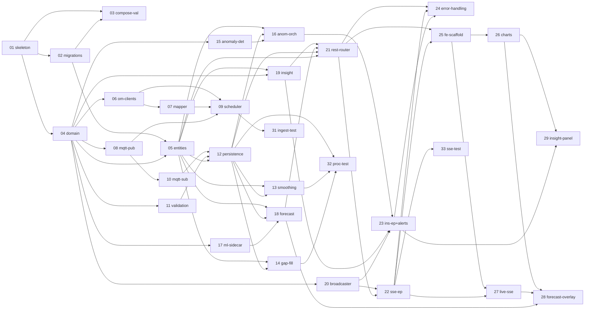

# Task Breakdown: Real-Time Environmental Sensor Dashboard

| Attribute       | Value                                                                           |
|-----------------|---------------------------------------------------------------------------------|
| **HLD Reference** | [HLD-sensor-dashboard.md](../HLD-sensor-dashboard.md)                        |
| **Created**     | 2026-05-22                                                                      |
| **Status**      | Draft                                                                           |
| **Version**     | 1.0                                                                             |

---

## Task Summary

| ID  | Task                                 | Domain          | Milestone | Dependencies          | Status  |
|-----|--------------------------------------|-----------------|-----------|-----------------------|---------|
| 01  | project-skeleton                     | Infrastructure  | M0        | —                     | pending |
| 02  | flyway-migrations                    | Data Layer      | M0        | 01                    | pending |
| 03  | compose-infra-validation             | Infrastructure  | M0        | 01, 02                | pending |
| 04  | domain-types                         | Domain          | M0        | 01                    | pending |
| 05  | r2dbc-entities-repos                 | Data Layer      | M2        | 02, 04                | pending |
| 06  | openmeteo-clients                    | Ingestion       | M1        | 04                    | pending |
| 07  | sensor-reading-mapper                | Ingestion       | M1        | 04, 06                | pending |
| 08  | mqtt-publisher                       | Ingestion       | M1        | 04                    | pending |
| 09  | ingestion-scheduler                  | Ingestion       | M1        | 06, 07, 08            | pending |
| 10  | mqtt-consumer                        | Processing      | M2        | 04, 08                | pending |
| 11  | validation-pipeline                  | Processing      | M2        | 04                    | pending |
| 12  | reading-persistence                  | Processing      | M2        | 05, 10, 11            | pending |
| 13  | smoothing-service                    | Processing      | M2        | 05, 12                | pending |
| 14  | gap-fill-service                     | Processing      | M2        | 05, 12                | pending |
| 15  | anomaly-detectors                    | Anomaly         | M3        | 04                    | pending |
| 16  | anomaly-orchestrator                 | Anomaly         | M3        | 05, 12, 15            | pending |
| 17  | ml-sidecar-python                    | ML              | M6        | 04                    | pending |
| 18  | forecast-client-orchestrator         | Forecast        | M6        | 05, 12, 17            | pending |
| 19  | insight-engine                       | Insight         | M7        | 04, 05                | pending |
| 20  | live-broadcaster                     | API             | M4        | 04                    | pending |
| 21  | rest-router                          | API             | M4        | 05, 12, 18, 19        | pending |
| 22  | sse-endpoints                        | API             | M4        | 20, 21                | pending |
| 23  | insight-endpoint-mqtt-alerts         | API             | M4        | 16, 19, 20            | pending |
| 24  | api-error-handling                   | API             | M4        | 21, 22, 23            | pending |
| 25  | frontend-scaffold                    | Frontend        | M5        | 21, 22                | pending |
| 26  | dashboard-charts                     | Frontend        | M5        | 25                    | pending |
| 27  | live-updates-sse                     | Frontend        | M5        | 22, 25                | pending |
| 28  | forecast-anomaly-overlay             | Frontend        | M5        | 18, 26, 27            | pending |
| 29  | insight-panel                        | Frontend        | M5/M7     | 23, 26                | pending |
| 30  | archunit-module-tests                | Testing         | M8        | 04–23                 | pending |
| 31  | ingestion-integration-test           | Testing         | M8        | 09                    | pending |
| 32  | processing-integration-test          | Testing         | M8        | 12, 13, 14            | pending |
| 33  | sse-integration-test                 | Testing         | M8        | 22                    | pending |
| 34  | compose-ci-readme                    | Polish          | M8        | all                   | pending |

---

## Dependency Graph

---

## Parallelism Opportunities

After task **01** is done, these can proceed in parallel:
- **04** (domain types) + **02** (migrations) simultaneously

After **04** is done:
- **06, 08, 11, 15, 17, 20** all independent — run in parallel

After **12** (persistence) unblocks:
- **13, 14, 16, 18** can all proceed in parallel

After **M4** API tasks (**21, 22, 23, 24**):
- **25** (frontend) + **30** (ArchUnit) + **31, 32, 33** (integration tests) in parallel

---

## Task Files

- [task-01-project-skeleton.md](./task-01-project-skeleton.md)
- [task-02-flyway-migrations.md](./task-02-flyway-migrations.md)
- [task-03-compose-infra-validation.md](./task-03-compose-infra-validation.md)
- [task-04-domain-types.md](./task-04-domain-types.md)
- [task-05-r2dbc-entities-repos.md](./task-05-r2dbc-entities-repos.md)
- [task-06-openmeteo-clients.md](./task-06-openmeteo-clients.md)
- [task-07-sensor-reading-mapper.md](./task-07-sensor-reading-mapper.md)
- [task-08-mqtt-publisher.md](./task-08-mqtt-publisher.md)
- [task-09-ingestion-scheduler.md](./task-09-ingestion-scheduler.md)
- [task-10-mqtt-consumer.md](./task-10-mqtt-consumer.md)
- [task-11-validation-pipeline.md](./task-11-validation-pipeline.md)
- [task-12-reading-persistence.md](./task-12-reading-persistence.md)
- [task-13-smoothing-service.md](./task-13-smoothing-service.md)
- [task-14-gap-fill-service.md](./task-14-gap-fill-service.md)
- [task-15-anomaly-detectors.md](./task-15-anomaly-detectors.md)
- [task-16-anomaly-orchestrator.md](./task-16-anomaly-orchestrator.md)
- [task-17-ml-sidecar-python.md](./task-17-ml-sidecar-python.md)
- [task-18-forecast-client-orchestrator.md](./task-18-forecast-client-orchestrator.md)
- [task-19-insight-engine.md](./task-19-insight-engine.md)
- [task-20-live-broadcaster.md](./task-20-live-broadcaster.md)
- [task-21-rest-router.md](./task-21-rest-router.md)
- [task-22-sse-endpoints.md](./task-22-sse-endpoints.md)
- [task-23-insight-endpoint-mqtt-alerts.md](./task-23-insight-endpoint-mqtt-alerts.md)
- [task-24-api-error-handling.md](./task-24-api-error-handling.md)
- [task-25-frontend-scaffold.md](./task-25-frontend-scaffold.md)
- [task-26-dashboard-charts.md](./task-26-dashboard-charts.md)
- [task-27-live-updates-sse.md](./task-27-live-updates-sse.md)
- [task-28-forecast-anomaly-overlay.md](./task-28-forecast-anomaly-overlay.md)
- [task-29-insight-panel.md](./task-29-insight-panel.md)
- [task-30-archunit-module-tests.md](./task-30-archunit-module-tests.md)
- [task-31-ingestion-integration-test.md](./task-31-ingestion-integration-test.md)
- [task-32-processing-integration-test.md](./task-32-processing-integration-test.md)
- [task-33-sse-integration-test.md](./task-33-sse-integration-test.md)
- [task-34-compose-ci-readme.md](./task-34-compose-ci-readme.md)

---

## Implementation Report

> Filled after implementation by `/backend-feature-impl`

### Summary

_To be filled_

### Files Changed

| File | Action | Purpose |
|------|--------|---------|
| _To be filled_ | | |

### Tests Added

| Test | Coverage |
|------|----------|
| _To be filled_ | |

### Code Review Findings

_To be filled_

### Verification

- [ ] All tests passing
- [ ] Code compiles without errors
- [ ] Matches architecture specification

---

## Revision History

| Date       | Version | Changes                |
|------------|---------|------------------------|
| 2026-05-22 | 1.0     | Initial task breakdown |
